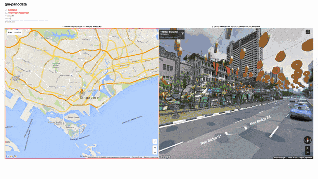

## gm-panodata
Copy paste latlng data easily from panorama streetview.

Hope it helps.

## What's wrong with current way of getting latlng data from googlemaps?
Generally 2 ways I know of:

Method 1 (on google map)
- right click > what's here? > copy paste latlng data.

Method 2 (from url)
- copy paste data from url params directly.

Method 3 (see demo below)
- drop pegman > drag panorama.
- ;)

## Demo

Demo link at http://htmlpreview.github.io/?https://github.com/simboonlong/gm-panodata/blob/master/index.html

## Usage
1. drop pegman on map.
2. drag panorama to get latlng + heading, pitch.

## Contributing
Feel free to contribute.