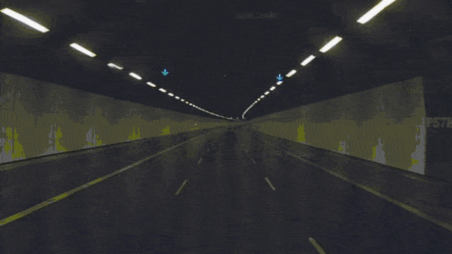

## gm-panodata
Copy paste lat/lng data easily from panorama streetview.

### How to get lat/lng data from googlemaps currently?
Generally 2 ways I know of:

1. On google map
    - right click > what's here? > copy paste lat/lng data.

2. From url
    - copy paste data from url params directly.

### But why?
- To stitch and create a drive through (hyperlapse) with the a more accurate lat/lng location in google streetview.
- To be more spontaneous when copy pasting the required lat/lng data.

### Demo

Demo link at http://htmlpreview.github.io/?https://github.com/simboonlong/gm-panodata/blob/master/index.html

### Usage
1. drop pegman in map on left panel.
2. drag panorama on right panel to get latlng + heading, pitch.
3. green indicates successful update of lat/lng data.
4. copy paste.

### Hyperlapse (1 possible use)

## Contributing
Feel free to contribute.